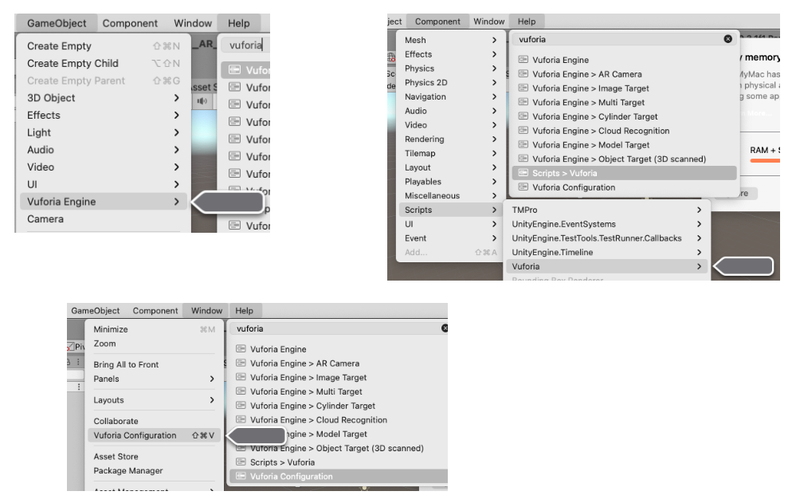

# Vuforia

Preços: <https://developer.vuforia.com>
Biblioteca: <https://library.vuforia.com>

## AssetStore Unity

Lista completa: <https://assetstore.unity.com/publishers/24484>

@dalton-reis: conjunto de recursos para iniciar o uso do Vuforia.
<https://assetstore.unity.com/packages/templates/packs/vuforia-core-samples-99026>
  Versão: 9.8.8 - 06/03/2021
  Unity versão: 2017.3.0 (ou superior)

Começando: <https://library.vuforia.com/articles/Training/getting-started-with-vuforia-in-unity-2017-2-beta.html>

**Atenção**: Importar um projeto completo substituirá as configurações do projeto atual. Se você não tiver certeza do que isso significa, deve alternar para um projeto vazio antes de importar este pacote.

### Imagens do Targets

<https://library.vuforia.com/articles/Solution/sample-apps-target-pdfs.html>
[Local](ImageTargets/)

### Guia de criação de Targets

<https://library.vuforia.com/features/images/image-targets.html>

## DownLoad Vuforia Engine

<https://developer.vuforia.com/downloads/sdk>

## Unity e Vuforia

- Menu
  - GameObject
    - Vuforia Engine
      - AR Camera
      - Image Target
      - Multi Target
      - Cylinder Target
      - Cloud Recognition
        - Cloud Recognition
        - Cloud Image Target
      - Model Target
      - Object Target (3D scanner)
      - VuMark
      - Area Target
      - Ground Plane
        - Plane Finder
        - Ground Plane Stage
      - Mid Air
        - Mid Air Positioner
        - Mid Air Stage
      - Session Recorder
  - Component
    - Scripts
      - Vuforia (.. muitos)
  - Window
    - Vuforia Configuration

## Vuforia Web Services

Download for Java / Download for PHP / Download for Python
<https://developer.vuforia.com/downloads/samples>

## External Camera

Download Driver Template / Download File Driver / Download UVC Driver (Android only)
<https://developer.vuforia.com/downloads/samples>

## Digital Eyewear

Download from Unity Asset Store
<https://developer.vuforia.com/downloads/samples>

## Produtos

### Vuforia Chalk: Remote Assistance Powered by Augmented Reality

<https://www.ptc.com>
<https://players.brightcove.net/1532789042001/HknUe20R_default/index.html?directedMigration=true&videoId=6164706217001&>

Free for 30 days

